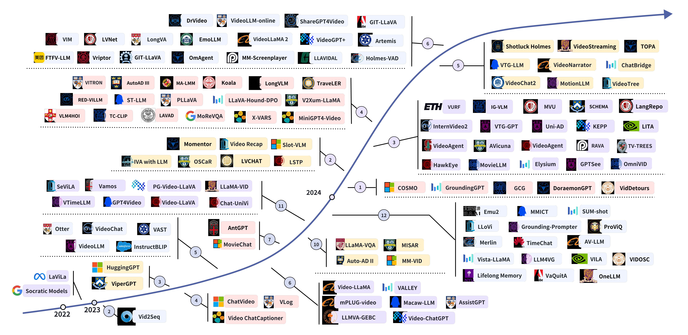

# Awesome-LLMs-for-Video-Understanding [](https://awesome.re)

### 🔥🔥🔥 [Video Understanding with Large Language Models: A Survey](https://arxiv.org/abs/2312.17432)

> *Yunlong Tang<sup>1,\*</sup>, Jing Bi<sup>1,\*</sup>, Siting Xu<sup>2,\*</sup>, Luchuan Song<sup>1</sup>, Susan Liang<sup>1</sup> , Teng Wang<sup>2,3</sup> , Daoan Zhang<sup>1</sup> , Jie An<sup>1</sup> , Jingyang Lin<sup>1</sup> , Rongyi Zhu<sup>1</sup> , Ali Vosoughi<sup>1</sup> , Chao Huang<sup>1</sup> , Zeliang Zhang<sup>1</sup> , Pinxin Liu<sup>1</sup> , Mingqian Feng<sup>1</sup> , Feng Zheng<sup>2</sup> , Jianguo Zhang<sup>2</sup> , Ping Luo<sup>3</sup> , Jiebo Luo<sup>1</sup>, Chenliang Xu<sup>1,†</sup>.*  (\*Core Contributors, †Corresponding Authors)

> *<sup>1</sup>University of Rochester, <sup>2</sup>Southern University of Science and Technology, <sup>3</sup>The University of Hong Kong*

<h5 align="center">  

 **[Paper](https://arxiv.org/pdf/2312.17432)** | **[Project Page](https://yunlong10.github.io/Awesome-LLMs-for-Video-Understanding/)**

</h5>


## 📢 News
[07/23/2024]

📢 We've recently updated our survey: “Video Understanding with Large Language Models: A Survey”!

✨ This comprehensive survey covers video understanding techniques powered by large language models (Vid-LLMs), training strategies, relevant tasks, datasets, benchmarks, and evaluation methods, and discusses the applications of Vid-LLMs across various domains.

🚀 **What's New in This Update**:
<br>✅ Updated to include around 100 additional Vid-LLMs and 15 new benchmarks as of June 2024.
<br>✅ Introduced a novel taxonomy for Vid-LLMs based on video representation and LLM functionality.
<br>✅ Added a Preliminary chapter, reclassifying video understanding tasks from the perspectives of granularity and language involvement, and enhanced the LLM Background section.
<br>✅ Added a new Training Strategies chapter, removing adapters as a factor for model classification.
<br>✅ All figures and tables have been redesigned.

Multiple minor updates will follow this major update. And the GitHub repository will be gradually updated soon. We welcome your reading and feedback ❤️

<font size=5><center><b> Table of Contents </b> </center></font>

[toc]


## Why we need Vid-LLMs?


## 😎 Vid-LLMs: Models 



### 📑 Citation

If you find our survey useful for your research, please cite the following paper:

```bibtex
@article{vidllmsurvey,
      title={Video Understanding with Large Language Models: A Survey}, 
      author={Tang, Yunlong and Bi, Jing and Xu, Siting and Song, Luchuan and Liang, Susan and Wang, Teng and Zhang, Daoan and An, Jie and Lin, Jingyang and Zhu, Rongyi and Vosoughi, Ali and Huang, Chao and Zhang, Zeliang and Zheng, Feng and Zhang, Jianguo and Luo, Ping and Luo, Jiebo and Xu, Chenliang},
      journal={arXiv preprint arXiv:2312.17432},
      year={2023},
}
```

### 🗒️ Taxonomy 1

#### 🕹️ Video Analyzer × LLM

##### LLM as Summarizer
| Title                                                        |        Model        |  Date   |                             Code                             | Venue |
| :----------------------------------------------------------- | :-----------------: | :-----: | :----------------------------------------------------------: | :---: |
| [**Seeing the Unseen: Visual Metaphor Captioning for Videos**](https://arxiv.org/html/2406.04886v1) |   GIT-LLaVA   | 06/2024 |      [code]()       | arXiv |
| [**Zero-shot long-form video understanding through screenplay**](https://arxiv.org/abs/2406.17309) |   MM-Screenplayer   | 06/2024 |      [project page]()       | CVPR |
| [**MoReVQA exploring modular reasoning models for video question answering**](https://arxiv.org/abs/2404.06511) |   MoReVQA   | 04/2024 |      [project page]()       | CVPR |
| [**An Image Grid Can Be Worth a Video: Zero-shot Video Question Answering Using a VLM**](https://arxiv.org/abs/2403.18406) |   IG-VLM   | 03/2024 |      [code](https://github.com/imagegridworth/IG-VLM)       | arXiv |
| [**Language repository for long video understanding**](https://arxiv.org/abs/2403.14622) |   LangRepo   | 03/2024 |      [code](https://github.com/kkahatapitiya/LangRepo)       | arXiv |
| [**Understanding long videos in one multimodal language model pass**](https://arxiv.org/abs/2403.16998) |   MVU   | 03/2024 |      [code](https://github.com/kahnchana/mvu)       | arXiv |
| [**Video ReCap recursive captioning of hour-long videos**](https://arxiv.org/abs/2402.13250) |   Video ReCap   | 02/2024 |      [code](https://sites.google.com/view/vidrecap)       | CVPR |
| [**A Simple LLM Framework for Long-Range Video Question-Answering**](https://arxiv.org/abs/2312.17235) |   LLoVi   | 12/2023 |      [code](https://github.com/CeeZh/LLoVi)       | arXiv |
| [**Grounding-prompter prompting LLM with multimodal information for temporal sentence grounding in long videos**](https://arxiv.org/abs/2312.17117) |   Grounding-prompter   | 12/2023 |      [code]()       | arXiv |
| [**Learning object state changes in videos an open-world perspective**](https://arxiv.org/abs/2312.11782) |   VIDOSC   | 12/2023 |      [code]()       | CVPR |
| [**AntGPT: Can Large Language Models Help Long-term Action Anticipation from Videos?**](https://arxiv.org/abs/2307.16368) |   AntGPT   | 07/2023 |      [code](https://brown-palm.github.io/AntGPT)       | ICLR |
| [**VAST: A Vision-Audio-Subtitle-Text Omni-Modality Foundation Model and Dataset**](https://arxiv.org/abs/2305.18500v1)[](https://github.com/txh-mercury/vast) |  VAST   | 05/2023 |    [code](https://github.com/txh-mercury/vast)     | NeurIPS |
| [**VLog: Video as a Long Document**](https://github.com/showlab/VLog)[](https://github.com/showlab/VLog) |        VLog         | 04/2023 |    [code](https://huggingface.co/spaces/TencentARC/VLog)     |   -   |
| [**Learning Video Representations from Large Language Models**](https://arxiv.org/abs/2212.04501)[](https://github.com/facebookresearch/lavila) | LaViLa  | 12/2022 | [code](https://github.com/facebookresearch/lavila) |  CVPR   |

##### LLM as Manager
| Title                                                        |        Model        |  Date   |                             Code                             | Venue |
| :----------------------------------------------------------- | :-----------------: | :-----: | :----------------------------------------------------------: | :---: |
| [**DrVideo: Document Retrieval Based Long Video Understanding**](https://arxiv.org/abs/2406.12846) |   DrVideo   | 06/2024 |      [code]()       | arXiv |
| [**OmAgent a multi-modal agent framework for complex video understanding with task divide-and-conquer**](https://arxiv.org/abs/2406.16620) |   OmAgent   | 06/2024 |      [code]()       | arXiv |
| [**Too Many Frames, not all Useful: Efficient Strategies for Long-Form Video QA**](https://arxiv.org/abs/2406.09396) |   LVNet   | 06/2024 |      [code](https://github.com/jongwoopark7978/LVNet)       | arXiv |
| [**VideoTree adaptive tree-based video representation for LLM reasoning on long videos**](https://arxiv.org/abs/2405.19209) |   VideoTree   | 05/2024 |      [code](https://videotree2024.github.io/)       | arXiv |
| [**Harnessing Large Language Models for Training-free Video Anomaly Detection**](https://arxiv.org/abs/2404.01014) |   LAVAD   | 04/2024 |      [code](https://lucazanella.github.io/lavad/)       | CVPR |
| [**TraveLER a multi-LMM agent framework for video question-answering**](https://arxiv.org/abs/2404.01476) |   TraveLER   | 04/2024 |      [code]()       | arXiv |
| [**GPTSee enhancing moment retrieval and highlight detection via description-based similarity features**](https://arxiv.org/abs/2403.01437) |   GPTSee   | 03/2024 |      [code]()       | arXiv |
| [**Reframe anything LLM agent for open world video reframing**](https://arxiv.org/abs/2403.06070) |   RAVA   | 03/2024 |      [code]()       | arXiv |
| [**SCHEMA state CHangEs MAtter for procedure planning in instructional videos**](https://arxiv.org/abs/2403.01599) |   SCHEMA   | 03/2024 |      [code]()       | ICLR |
| [**TV-TREES multimodal entailment trees for neuro-symbolic video reasoning**](https://arxiv.org/abs/2402.19467) |   TV-TREES   | 02/2024 |      [code]()       | arXiv |
| [**VideoAgent: A Memory-augmented Multimodal Agent for Video Understanding**](https://arxiv.org/abs/2403.11481) | VideoAgent  | 03/2024 |[project page](https://videoagent.github.io/)| arXiv |
| [**VideoAgent long-form video understanding with large language model as agent**](https://arxiv.org/abs/2403.10517) |   VideoAgent   | 03/2024 |      [code]()       | arXiv |
| [**VURF a general-purpose reasoning and self-refinement framework for video understanding**](https://arxiv.org/abs/2403.14743) |   VURF   | 03/2024 |      [code]()       | arXiv |
| [**Why not use your textbook knowledge-enhanced procedure planning of instructional videos**](https://arxiv.org/abs/2403.02782) |   KEPP   | 03/2024 |      [code]()       | CVPR |
| [**DoraemonGPT toward understanding dynamic scenes with large language models**](https://arxiv.org/abs/2401.08392) |   DoraemonGPT   | 01/2024 |      [code](https://github.com/z-x-yang/DoraemonGPT)       | arXiv |
| [**LifelongMemory: Leveraging LLMs for Answering Queries in Long-form Egocentric Videos**](https://arxiv.org/abs/2312.05269) |   LifelongMemory   | 12/2023 |      [code](https://github.com/Agentic-Learning-AI-Lab/lifelong-memory)       | arXiv |
| [**Zero-Shot Video Question Answering with Procedural Programs**](https://arxiv.org/abs/2312.00937) |   ProViQ   | 12/2023 |      [code](https://rccchoudhury.github.io/proviq2023)       | arXiv |
| [**AssistGPT: A General Multi-modal Assistant that can Plan, Execute, Inspect, and Learn**](https://arxiv.org/abs/2306.08640) |   AssistGPT   | 06/2023 |      [code](https://showlab.github.io/assistgpt/)       | arXiv |
| [**ChatVideo: A Tracklet-centric Multimodal and Versatile Video Understanding System**](https://arxiv.org/abs/2304.14407) |      ChatVideo      | 04/2023 |    [project page](https://www.wangjunke.info/ChatVideo/)     | arXiv |
| [**Video ChatCaptioner: Towards Enriched Spatiotemporal Descriptions**](https://arxiv.org/abs/2304.04227)[](https://github.com/Vision-CAIR/ChatCaptioner/tree/main/Video_ChatCaptioner) | Video ChatCaptioner | 04/2023 | [code](https://github.com/Vision-CAIR/ChatCaptioner/tree/main/Video_ChatCaptioner) | arXiv |
| [**ViperGPT: Visual Inference via Python Execution for Reasoning**](https://arxiv.org/abs/2303.08128) |   ViperGPT   | 03/2023 |      [code](https://viper.cs.columbia.edu/)       | arXiv |
| [**Hawk: Learning to Understand Open-World Video Anomalies**](https://arxiv.org/abs/2405.16886) |   Hawk   | 05/2024 |      [code](https://github.com/jqtangust/hawk)       | arXiv |

#### 👾 Video Embedder × LLM

##### LLM as Text Decoder

| Title                                                        |        Model        |  Date   |                             Code                             | Venue |
| :----------------------------------------------------------- | :-----------------: | :-----: | :----------------------------------------------------------: | :---: |
| [**AuroraCap: Efficient, Performant Video Detailed Captioning and a New Benchmark**](https://arxiv.org/abs/2410.03051) |   AuroraCap   | 10/2024 |      [project page](https://rese1f.github.io/aurora-web/)       | arXiv |
| [**Artemis towards referential understanding in complex videos**](https://arxiv.org/abs/2406.00258) |   Artemis   | 06/2024 |      [code](https://github.com/qiujihao19/Artemis)       | arXiv |
| [**EmoLLM multimodal emotional understanding meets large language models**](https://arxiv.org/abs/2406.16442) |   EmoLLM   | 06/2024 |      [code](https://github.com/yan9qu/EmoLLM)       | arXiv |
| [**Fewer tokens and fewer videos extending video understanding abilities in large vision-language models**](https://arxiv.org/abs/2406.08024) |   FTFV-LLM   | 06/2024 |      -      | arXiv |
| [**Flash-VStream: Memory-Based Real-Time Understanding for Long Video Streams**](https://arxiv.org/abs/2406.08085) |   Flash-VStream   | 06/2024 |      [code](https://invinciblewyq.github.io/vstream-page/)       | arXiv |
| [**LLAVIDAL benchmarking large language vision models for daily activities of living**](https://arxiv.org/abs/2406.09390) |   LLAVIDAL   | 06/2024 |      [code](https://adl-x.github.io/)       | arXiv |
| [**Long context transfer from language to vision**](https://arxiv.org/abs/2406.16852) |   LongVA   | 06/2024 |      [code](https://github.com/EvolvingLMMs-Lab/LongVA)       | arXiv |
| [**ShareGPT4Video improving video understanding and generation with better captions**](https://arxiv.org/abs/2406.04325) |   ShareGPT4Video   | 06/2024 |      [code](https://sharegpt4video.github.io/)       | arXiv |
| [**Towards event-oriented long video understanding**](https://arxiv.org/abs/2406.14129) |   VIM   | 06/2024 |      [code](https://github.com/RUCAIBox/Event-Bench)       | arXiv |
| [**Video-SALMONN speech-enhanced audio-visual large language models**](https://arxiv.org/abs/2406.15704) |   Video-SALMONN   | 06/2024 |      [code](https://github.com/bytedance/SALMONN/)       | ICML |
| [**VideoGPT+ integrating image and video encoders for enhanced video understanding**](https://arxiv.org/abs/2406.09418) |   VideoGPT+   | 06/2024 |      [code](https://github.com/mbzuai-oryx/VideoGPT-plus)       | arXiv |
| [**VideoLLaMA 2 advancing spatial-temporal modeling and audio understanding in video-LLMs**](https://arxiv.org/abs/2406.07476) |   VideoLLaMA 2   | 06/2024 |      [code](https://github.com/DAMO-NLP-SG/VideoLLaMA2)       | arXiv |
| [**MotionLLM: Understanding Human Behaviors from Human Motions and Videos**](https://arxiv.org/abs/2405.20340) |   MotionLLM   | 05/2024 |      [project page](https://lhchen.top/MotionLLM)       | arXiv |
| [**MVBench: A Comprehensive Multi-modal Video Understanding Benchmark**](https://arxiv.org/abs/2311.17005) |   VideoChat2   | 11/2023 |      [code](https://github.com/OpenGVLab/Ask-Anything)       | CVPR |
| [**Shotluck Holmes: A Family of Efficient Small-Scale Large Language Vision Models For Video Captioning and Summarization**](https://arxiv.org/abs/2405.20648) |   Shotluck Holmes   | 05/2024 |      -      | arXiv |
| [**Streaming long video understanding with large language models**](https://www.arxiv.org/abs/2405.16009) |   VideoStreaming   | 05/2024 |      -       | arXiv |
| [**Synchronized Video Storytelling: Generating Video Narrations with Structured Storyline**](https://arxiv.org/html/2405.14040v1) |   VideoNarrator   | 05/2024 |      -       | arXiv |
| [**TOPA extend large language models for video understanding via text-only pre-alignment**](https://arxiv.org/abs/2405.13911) |   TOPA   | 05/2024 |      [code](https://github.com/dhg-wei/TOPA)       | NeurIPS |
| [**MovieChat+: Question-aware Sparse Memory for Long Video Question Answering**](https://arxiv.org/abs/2404.17176) |   MovieChat+   | 04/2024 |      [code](https://github.com/rese1f/MovieChat)       | arXiv |
| [**AutoAD III: The Prequel – Back to the Pixels**](https://arxiv.org/abs/2404.14412) |   AutoAD III   | 04/2024 |      [project page](https://www.robots.ox.ac.uk/~vgg/research/autoad/)       | CVPR |
| [**Direct Preference Optimization of Video Large Multimodal Models from Language Model Reward**](https://arxiv.org/abs/2404.01258) |   LLaVA-Hound-DPO   | 04/2024 |      [code](https://github.com/RifleZhang/LLaVA-Hound-DPO)       | arXiv |
| [**From image to video, what do we need in multimodal LLMs**](https://arxiv.org/abs/2404.11865) |   RED-VILLM   | 04/2024 |      -       | arXiv |
| [**Koala key frame-conditioned long video-LLM**](https://arxiv.org/abs/2404.04346) |   Koala   | 04/2024 |      [project page](https://cs-people.bu.edu/rxtan/projects/Koala)       | CVPR |
| [**LongVLM efficient long video understanding via large language models**](https://arxiv.org/abs/2404.03384) |   LongVLM   | 04/2024 |      [code](https://github.com/ziplab/LongVLM)       | ECCV |
| [**MA-LMM memory-augmented large multimodal model for long-term video understanding**](https://arxiv.org/abs/2404.05726) |   MA-LMM   | 04/2024 |      [code](https://boheumd.github.io/MA-LMM/)       | CVPR |
| [**MiniGPT4-video advancing multimodal LLMs for video understanding with interleaved visual-textual tokens**](https://arxiv.org/abs/2404.03413) |   MiniGPT4-Video   | 04/2024 |      [code](https://vision-cair.github.io/MiniGPT4-video/)       | arXiv |
| [**Pegasus-v1 technical report**](https://arxiv.org/abs/2404.14687) |   Pegasus-v1   | 04/2024 |      [code]()       | arXiv |
| [**PLLaVA : Parameter-free LLaVA Extension from Images to Videos for Video Dense Captioning**](https://arxiv.org/abs/2404.16994) |   PLLaVA   | 04/2024 |      [code](https://pllava.github.io/)       | arXiv |
| [**ST-LLM: Large Language Models Are Effective Temporal Learners**](https://arxiv.org/abs/2404.00308) |   ST-LLM   | 04/2024 |      [code](https://github.com/TencentARC/ST-LLM)       | arXiv |
| [**Tarsier recipes for training and evaluating large video description models**](https://arxiv.org/abs/2407.00634) |   Tarsier   | 07/2024 |      [code](https://github.com/bytedance/tarsier)       | arXiv |
| [**X-VARS introducing explainability in football refereeing with multi-modal large language model**](https://arxiv.org/abs/2404.06332) |   X-VARS   | 04/2024 |      [code]()       | arXiv |
| [**CAT: Enhancing Multimodal Large Language Model to Answer Questions in Dynamic Audio-Visual Scenarios**](https://arxiv.org/abs/2403.04640) |   CAT   | 03/2024 |      [code](https://github.com/rikeilong/Bay-CAT)       | arXiv |
| [**InternVideo2 scaling video foundation models for multimodal video understanding**](https://arxiv.org/abs/2403.15377) |   InternVideo2   | 03/2024 |      [code](https://github.com/OpenGVLab/InternVideo/tree/main/InternVideo2)       | ECCV |
| [**MovieLLM enhancing long video understanding with AI-generated movies**](https://arxiv.org/abs/2403.01422) |   MovieLLM   | 03/2024 |      [code](https://deaddawn.github.io/MovieLLM/)       | arXiv |
| [**LLMs meet long video advancing long video comprehension with an interactive visual adapter in LLMs**](https://arxiv.org/abs/2402.13546) |   IVAwithLLM   | 02/2024 |      [code]()       | arXiv |
| [**LSTP language-guided spatial-temporal prompt learning for long-form video-text understanding**](https://arxiv.org/abs/2402.16050) |   LSTP   | 02/2024 |      [code](https://github.com/bigai-nlco/VideoTGB)       | EMNLP |
| [**LVCHAT facilitating long video comprehension**](https://arxiv.org/abs/2402.12079) |   LVCHAT   | 02/2024 |      [code](https://github.com/wangyu-ustc/LVChat)       | arXiv |
| [**OSCaR: Object State Captioning and State Change Representation**](https://arxiv.org/abs/2402.17128) |   OSCaR   | 02/2024 |      [code](https://github.com/nguyennm1024/OSCaR)       | NAACL |
| [**Slot-VLM SlowFast slots for video-language modeling**](https://arxiv.org/abs/2402.13088) |   Slot-VLM   | 02/2024 |      [code]()       | arXiv |
| [**COSMO: COntrastive Streamlined MultimOdal Model with Interleaved Pre-Training**](https://arxiv.org/abs/2401.00849) |   COSMO   | 01/2024 |      [code](http://fingerrec.github.io/cosmo)       | arXiv |
| [**Weakly supervised gaussian contrastive grounding with large multimodal models for video question answering**](https://arxiv.org/abs/2401.10711) |   GCG   | 01/2024 |      [code](https://github.com/WHB139426/GCG)       | ACMMM |
| [**Audio-Visual LLM for Video Understanding**](https://arxiv.org/abs/2312.06720) |   AV-LLM   | 12/2023 |      [code]()       | arXiv |
| [**Generative Multimodal Models are In-Context Learners**](https://arxiv.org/abs/2312.13286) |   Emu2   | 12/2023 |      [project page](https://baaivision.github.io/emu2)       | CVPR |
| [**MMICT: Boosting Multi-Modal Fine-Tuning with In-Context Examples**](https://arxiv.org/abs/2312.06363) |   MMICT   | 12/2023 |      [code](https://github.com/KDEGroup/MMICT)       | TOMM |
| [**VaQuitA : Enhancing Alignment in LLM-Assisted Video Understanding**](https://arxiv.org/abs/2312.02310) |   VaQuitA   | 12/2023 |      [code]()       | arXiv |
| [**VILA: On Pre-training for Visual Language Models**](https://arxiv.org/abs/2312.07533) |   VILA   | 12/2023 |      [code](https://github.com/NVlabs/VILA)       | CVPR |
| [**Vista-LLaMA reliable video narrator via equal distance to visual tokens**](https://arxiv.org/abs/2312.08870) |   Vista-LLaMA   | 12/2023 |      [project page](https://jinxxian.github.io/Vista-LLaMA)       | arXiv |
| [**Chat-UniVi unified visual representation empowers large language models with image and video understanding**](https://arxiv.org/abs/2311.08046) |   Chat-UniVi   | 11/2023 |      [code](https://github.com/PKU-YuanGroup/Chat-UniVi)       | CVPR |
| [**LLaMA-VID: An Image is Worth 2 Tokens in Large Language Models**](https://arxiv.org/abs/2311.17043) |   LLaMA-VID   | 11/2023 |      [code](https://github.com/dvlab-research/LLaMA-VID)       | arXiv |
| [**Video-LLaVA learning united visual representation by alignment before projection**](https://arxiv.org/abs/2311.10122) |   Video-LLaVA   | 11/2023 |      [code](https://github.com/PKU-YuanGroup/Video-LLaVA)       | arXiv |
| [**Large Language Models are Temporal and Causal Reasoners for Video Question Answering**](https://arxiv.org/abs/2310.15747) |   LLaMA-VQA   | 10/2023 |      [code](https://github.com/mlvlab/Flipped-VQA)       | EMNLP |
| [**MovieChat: From Dense Token to Sparse Memory for Long Video Understanding**](https://arxiv.org/abs/2307.16449) |   MovieChat   | 07/2023 |      [code](https://rese1f.github.io/MovieChat/)       | CVPR |
| [**LLMVA-GEBC: Large Language Model with Video Adapter for Generic Event Boundary Captioning**](https://arxiv.org/abs/2306.10354) |   LLMVA-GEBC   | 06/2023 |      [code](https://github.com/zjr2000/LLMVA-GEBC)       | CVPR |
| [**Macaw-LLM: Multi-Modal Language Modeling with Image, Audio, Video, and Text Integration**](https://arxiv.org/abs/2306.09093) |   Macaw-LLM   | 06/2023 |      [project page](https://github.com/lyuchenyang/Macaw-LLM)       | arXiv |
| [**Valley: Video Assistant with Large Language model Enhanced abilitY**](https://arxiv.org/abs/2306.07207) |   VALLEY   | 06/2023 |      [code]()       | arXiv |
| [**Video-ChatGPT: Towards Detailed Video Understanding via Large Vision and Language Models**](https://arxiv.org/abs/2306.05424) |   Video-ChatGPT   | 06/2023 |      [code](https://github.com/mbzuai-oryx/Video-ChatGPT)       | ACL |
| [**Video-LLaMA: An Instruction-tuned Audio-Visual Language Model for Video Understanding**](https://arxiv.org/abs/2306.02858) |   Video-LLaMA   | 06/2023 |      [code](https://github.com/DAMO-NLP-SG/Video-LLaMA)       | EMNLP |
| [**Youku-mPLUG: A 10 Million Large-scale Chinese Video-Language Dataset for Pre-training and Benchmarks**](https://arxiv.org/abs/2306.04362) |   mPLUG-video   | 06/2023 |      [code](https://github.com/X-PLUG/Youku-mPLUG)       | arXiv |
| [**ChatBridge: Bridging Modalities with Large Language Model as a Language Catalyst**](https://arxiv.org/abs/2305.16103) |   ChatBridge   | 05/2023 |      [code](https://iva-chatbridge.github.io)       | arXiv |
| [**Otter: A Multi-Modal Model with In-Context Instruction Tuning**](https://arxiv.org/abs/2305.03726) |   Otter   | 05/2023 |      [code](https://github.com/Luodian/Otter)       | arXiv |
| [**VideoLLM: Modeling Video Sequence with Large Language Models**](https://arxiv.org/abs/2305.13292) |   VideoLLM   | 05/2023 |      [code](https://github.com/cg1177/VideoLLM)       | arXiv |

##### LLM as Regressor

<!-- 
| [**title**](link) |   model   | date |      [code](link)       | venue |
 -->
| Title                                                        |        Model        |  Date   |                             Code                             | Venue |
| :----------------------------------------------------------- | :-----------------: | :-----: | :----------------------------------------------------------: | :---: |
| [**Holmes-VAD: Towards Unbiased and Explainable Video Anomaly Detection via Multi-modal LLM**](https://arxiv.org/abs/2406.12235) |   Holmes-VAD   | 06/2024 |      [code](https://holmesvad.github.io/)       | arXiv |
| [**VideoLLM-online online video large language model for streaming video**](https://arxiv.org/abs/2406.11816) |   VideoLLM-online   | 06/2024 |      [code](https://showlab.github.io/videollm-online)       | CVPR |
| [**HOI-Ref: Hand-Object Interaction Referral in Egocentric Vision**](https://arxiv.org/abs/2404.09933) |   VLM4HOI   | 04/2024 |      [project page](https://sid2697.github.io/hoi-ref/)       | arXiv |
| [**V2Xum-LLM cross-modal video summarization with temporal prompt instruction tuning**](https://arxiv.org/abs/2404.12353) |   V2Xum-LLaMA   | 04/2024 |      [code](https://hanghuacs.github.io/v2xum/)       | arXiv |
| [**AVicuna: Audio-Visual LLM with Interleaver and Context-Boundary Alignment for Temporal Referential Dialogue**](https://arxiv.org/abs/2403.16276) |   AVicuna   | 03/2024 |      [code]()       | arXiv |
| [**Elysium exploring object-level perception in videos via MLLM**](https://arxiv.org/abs/2403.16558) |   Elysium   | 03/2024 |      [code](https://github.com/Hon-Wong/Elysium)       | arXiv |
| [**HawkEye training video-text LLMs for grounding text in videos**](https://arxiv.org/abs/2403.10228) |   HawkEye   | 03/2024 |      [code](https://github.com/yellow-binary-tree/HawkEye)       | arXiv |
| [**LITA language instructed temporal-localization assistant**](https://arxiv.org/abs/2403.19046) |   LITA   | 03/2024 |      [code](https://github.com/NVlabs/LITA)       | arXiv |
| [**OmniViD: A Generative Framework for Universal Video Understanding**](https://arxiv.org/abs/2403.17935) |   OmniViD   | 03/2024 |      [code](https://github.com/wangjk666/OmniVid)       | CVPR |
| [**GroundingGPT: Language Enhanced Multi-modal Grounding Model**](https://arxiv.org/abs/2401.06071) |   GroundingGPT   | 01/2024 |      [code](https: //github.com/lzw-lzw/GroundingGPT)       | arXiv |
| [**TimeChat a time-sensitive multimodal large language model for long video understanding**](https://arxiv.org/abs/2312.02051) |   TimeChat   | 12/2023 |      [code](https://github.com/RenShuhuai-Andy/TimeChat)       | CVPR |
| [**Self-Chained Image-Language Model for Video Localization and Question Answering**](https://arxiv.org/abs/2305.06988) |   SeViLA   | 11/2023 |      [code](https://github.com/Yui010206/SeViLA)       | NeurIPS |
| [**VTimeLLM: Empower LLM to Grasp Video Moments**](https://arxiv.org/abs/2311.18445) |   VTimeLLM   | 11/2023 |      [code](https://github.com/huangb23/VTimeLLM)       | arXiv |

##### LLM as Hidden Layer
 | Title                                                        |        Model        |  Date   |                             Code                             | Venue |
| :----------------------------------------------------------- | :-----------------: | :-----: | :----------------------------------------------------------: | :---: |
| [**VTG-LLM integrating timestamp knowledge into video LLMs for enhanced video temporal grounding**](https://arxiv.org/abs/2405.13382) |   VTG-LLM   | 05/2024 |      [code](https://github.com/gyxxyg/VTG-LLM)       | arXiv |
| [**VITRON: A Unified Pixel-level Vision LLM for Understanding, Generating, Segmenting, Editing**](https://haofei.vip/downloads/papers/Skywork_Vitron_2024.pdf) |   VITRON   | 04/2024 |      [project page](https://vitron-llm.github.io/)       | NeurIPS |
| [**VTG-GPT: Tuning-Free Zero-Shot Video Temporal Grounding with GPT**](https://arxiv.org/abs/2403.02076) |   VTG-GPT   | 03/2024 |      [code](https://github.com/YoucanBaby/VTG-GPT)       | arXiv |
| [**Momentor advancing video large language model with fine-grained temporal reasoning**](https://arxiv.org/abs/2402.11435) |   Momentor   | 02/2024 |      [code](https://github.com/DCDmllm/Momentor)       | ICML |
| [**Detours for navigating instructional videos**](https://arxiv.org/abs/2401.01823) |   VidDetours   | 01/2024 |      [code]()       | CVPR |
| [**OneLLM: One Framework to Align All Modalities with Language**](https://arxiv.org/abs/2312.03700) |   OneLLM   | 12/2023 |      [code](https://github.com/csuhan/OneLLM)       | arXiv |
| [**GPT4Video a unified multimodal large language model for lnstruction-followed understanding and safety-aware generation**](https://arxiv.org/abs/2311.16511) |   GPT4Video   | 11/2023 |      [code](https://gpt4video.github.io)       | ACMMM |

#### 🦾 (Analyzer + Embedder) × LLM

##### LLM as Manager
 | Title                                                        |        Model        |  Date   |                             Code                             | Venue |
| :----------------------------------------------------------- | :-----------------: | :-----: | :----------------------------------------------------------: | :---: |
| [**MM-VID: Advancing Video Understanding with GPT-4V(ision)**](https://arxiv.org/abs/2310.19773) |       MM-VID        | 10/2023 |                              -                               | arXiv |
##### LLM as Summarizer
 | Title                                                        |        Model        |  Date   |                             Code                             | Venue |
| :----------------------------------------------------------- | :-----------------: | :-----: | :----------------------------------------------------------: | :---: |
| [**Shot2Story20K a new benchmark for comprehensive understanding of multi-shot videos**](https://arxiv.org/abs/2312.10300) |   SUM-shot   | 12/2023 |      [code](https://mingfei.info/shot2story/)       | arXiv |
##### LLM as Regressor
 | Title                                                        |        Model        |  Date   |                             Code                             | Venue |
| :----------------------------------------------------------- | :-----------------: | :-----: | :----------------------------------------------------------: | :---: |
| [**Vript: A Video Is Worth Thousands of Words**](https://arxiv.org/abs/2406.06040) |   Vriptor   | 06/2024 |      [code](https://github.com/mutonix/Vript)       | NeurIPS |
| [**Merlin:Empowering Multimodal LLMs with Foresight Minds**](https://arxiv.org/abs/2312.00589) |   Merlin   | 12/2023 |      [project page](https://ahnsun.github.io/merlin)       | ECCV |
| [**VideoChat: Chat-Centric Video Understanding**](https://arxiv.org/abs/2305.06355) |   VideoChat   | 05/2023 |      [code](https://github.com/OpenGVLab/Ask-Anything)       | arXiv |
| [**Vid2Seq: Large-Scale Pretraining of a Visual Language Model for Dense Video Captioning**](https://arxiv.org/abs/2302.14115) |   Vid2Seq   | 02/2023 |      [code](https://antoyang.github.io/vid2seq.html)       | CVPR |
##### LLM as Text Decoder
 | Title                                                        |        Model        |  Date   |                             Code                             | Venue |
| :----------------------------------------------------------- | :-----------------: | :-----: | :----------------------------------------------------------: | :---: |
| [**Contextual AD Narration with Interleaved Multimodal Sequence**](https://arxiv.org/abs/2403.12922) |   Uni-AD   | 03/2024 |      [code](https://github.com/MCG-NJU/Uni-AD)       | arXiv |
| [**MM-Narrator: Narrating Long-form Videos with Multimodal In-Context Learning**](https://arxiv.org/abs/2311.17435) |   MM-narrator   | 11/2023 |      [project page](https://mm-narrator.github.io/)       | arXiv |
| [**Vamos: Versatile Action Models for Video Understanding**](https://arxiv.org/abs/2311.13627) |   Vamos   | 11/2023 |      [project page](https://brown-palm.github.io/Vamos/)       | ECCV |
| [**AutoAD II: The Sequel -- Who, When, and What in Movie Audio Description**](https://arxiv.org/abs/2310.06838) |   Auto-AD II   | 10/2023 |      [project page](https://www.robots.ox.ac.uk/vgg/research/autoad/)       | ICCV |
##### LLM as Hidden Layer
 | Title                                                        |        Model        |  Date   |                             Code                             | Venue |
| :----------------------------------------------------------- | :-----------------: | :-----: | :----------------------------------------------------------: | :---: |
| [**PG-Video-LLaVA: Pixel Grounding Large Video-Language Models**](https://arxiv.org/abs/2311.13435v2)[](https://github.com/mbzuai-oryx/video-llava) |   PG-Video-LLaVA    | 11/2023 |      [code](https://github.com/mbzuai-oryx/video-llava)      | arXiv |
### 🗒️ Taxonomy 2

#### 🤖 LLM-based Video Agents

| Title                                                        |        Model        |  Date   |                             Code                             | Venue |
| :----------------------------------------------------------- | :-----------------: | :-----: | :----------------------------------------------------------: | :---: |
| [**Socratic Models: Composing Zero-Shot Multimodal Reasoning with Language**](https://arxiv.org/abs/2204.00598) |   Socratic Models   | 04/2022 |      [project page](https://socraticmodels.github.io/)       | arXiv |
| [**Video ChatCaptioner: Towards Enriched Spatiotemporal Descriptions**](https://arxiv.org/abs/2304.04227)[](https://github.com/Vision-CAIR/ChatCaptioner/tree/main/Video_ChatCaptioner) | Video ChatCaptioner | 04/2023 | [code](https://github.com/Vision-CAIR/ChatCaptioner/tree/main/Video_ChatCaptioner) | arXiv |
| [**VLog: Video as a Long Document**](https://github.com/showlab/VLog)[](https://github.com/showlab/VLog) |        VLog         | 04/2023 |    [code](https://huggingface.co/spaces/TencentARC/VLog)     |   -   |
| [**ChatVideo: A Tracklet-centric Multimodal and Versatile Video Understanding System**](https://arxiv.org/abs/2304.14407) |      ChatVideo      | 04/2023 |    [project page](https://www.wangjunke.info/ChatVideo/)     | arXiv |
| [**MM-VID: Advancing Video Understanding with GPT-4V(ision)**](https://arxiv.org/abs/2310.19773) |       MM-VID        | 10/2023 |                              -                               | arXiv |
| [**MISAR: A Multimodal Instructional System with Augmented Reality**](https://arxiv.org/abs/2310.11699v1)[](https://github.com/nguyennm1024/misar) |        MISAR        | 10/2023 |    [project page](https://github.com/nguyennm1024/misar)     | ICCV  |
| [**Grounding-Prompter: Prompting LLM with Multimodal Information for Temporal Sentence Grounding in Long Videos**](https://arxiv.org/abs/2312.17117) | Grounding-Prompter  | 12/2023 |                              -                               | arXiv |
| [**NaVid: Video-based VLM Plans the Next Step for Vision-and-Language Navigation**](https://arxiv.org/pdf/2402.15852) | NaVid  | 02/2024 |     [project page](https://pku-epic.github.io/NaVid/)                         -      | RSS |
| [**VideoAgent: A Memory-augmented Multimodal Agent for Video Understanding**](https://arxiv.org/abs/2403.11481) | VideoAgent  | 03/2024 |                              [project page](https://videoagent.github.io/)                               | arXiv |
| [**VideoINSTA: Zero-shot Long Video Understanding via Informative Spatial-Temporal Reasoning with LLMs**](https://arxiv.org/pdf/2409.20365) |   VideoINSTA   | 09/2024 |      [code](https://github.com/mayhugotong/VideoINSTA)       | EMNLP |


#### 👾 Vid-LLM Pretraining

| Title                                                        |  Model  |  Date   |                        Code                        |  Venue  |
| :----------------------------------------------------------- | :-----: | :-----: | :------------------------------------------------: | :-----: |
| [**Learning Video Representations from Large Language Models**](https://arxiv.org/abs/2212.04501)[](https://github.com/facebookresearch/lavila) | LaViLa  | 12/2022 | [code](https://github.com/facebookresearch/lavila) |  CVPR   |
| [**Vid2Seq: Large-Scale Pretraining of a Visual Language Model for Dense Video Captioning**](https://arxiv.org/abs/2302.14115) | Vid2Seq | 02/2023 |  [code](https://antoyang.github.io/vid2seq.html)   |  CVPR   |
| [**VAST: A Vision-Audio-Subtitle-Text Omni-Modality Foundation Model and Dataset**](https://arxiv.org/abs/2305.18500v1)[](https://github.com/txh-mercury/vast) |  VAST   | 05/2023 |    [code](https://github.com/txh-mercury/vast)     | NeurIPS |
| [**Merlin:Empowering Multimodal LLMs with Foresight Minds**](https://arxiv.org/abs/2312.00589v1) | Merlin  | 12/2023 |                         -                          |  arXiv  |

#### 👀 Vid-LLM Instruction Tuning

##### Fine-tuning with Connective Adapters

| Title                                                        |     Model     |  Date   |                         Code                         | Venue |
| :----------------------------------------------------------- | :-----------: | :-----: | :--------------------------------------------------: | :---: |
| [**Video-LLaMA: An Instruction-Finetuned Visual Language Model for Video Understanding**](https://arxiv.org/abs/2306.02858) [](https://github.com/DAMO-NLP-SG/Video-LLaMA) |  Video-LLaMA  | 06/2023 |  [code](https://github.com/DAMO-NLP-SG/Video-LLaMA)  | arXiv |
| [**VALLEY: Video Assistant with Large Language model Enhanced abilitY**](https://arxiv.org/abs/2306.07207)[](https://github.com/RupertLuo/Valley) |    VALLEY     | 06/2023 |     [code](https://github.com/RupertLuo/Valley)      |   -   |
| [**Video-ChatGPT: Towards Detailed Video Understanding via Large Vision and Language Models**](https://arxiv.org/abs/2306.05424)[](https://github.com/mbzuai-oryx/Video-ChatGPT) | Video-ChatGPT | 06/2023 | [code](https://github.com/mbzuai-oryx/Video-ChatGPT) | arXiv |
| [**Macaw-LLM: Multi-Modal Language Modeling with Image, Audio, Video, and Text Integration**](https://arxiv.org/abs/2306.09093)[](https://github.com/lyuchenyang/macaw-llm) |   Macaw-LLM   | 06/2023 |   [code](https://github.com/lyuchenyang/macaw-llm)   | arXiv |
| [**LLMVA-GEBC: Large Language Model with Video Adapter for Generic Event Boundary Captioning**](https://arxiv.org/abs/2306.10354) [](https://github.com/zjr2000/llmva-gebc) |  LLMVA-GEBC   | 06/2023 |    [code](https://github.com/zjr2000/llmva-gebc)     | CVPR  |
| [**Youku-mPLUG: A 10 Million Large-scale Chinese Video-Language Dataset for Pre-training and Benchmarks**](https://arxiv.org/abs/2306.04362) [](https://github.com/x-plug/youku-mplug) |  mPLUG-video  | 06/2023 |    [code](https://github.com/x-plug/youku-mplug)     | arXiv |
| [**MovieChat: From Dense Token to Sparse Memory for Long Video Understanding**](https://arxiv.org/abs/2307.16449)[](https://github.com/rese1f/MovieChat) |   MovieChat   | 07/2023 |     [code](https://github.com/rese1f/MovieChat)      | arXiv |
| [**Large Language Models are Temporal and Causal Reasoners for Video Question Answering**](https://arxiv.org/abs/2310.15747)[](https://github.com/mlvlab/Flipped-VQA) |   LLaMA-VQA   | 10/2023 |    [code](https://github.com/mlvlab/Flipped-VQA)     | EMNLP |
| [**Video-LLaVA: Learning United Visual Representation by Alignment Before Projection**](https://arxiv.org/pdf/2311.10122v2.pdf)[](https://github.com/PKU-YuanGroup/Video-LLaVA) |  Video-LLaVA  | 11/2023 | [code](https://github.com/PKU-YuanGroup/Video-LLaVA) | arXiv |
| [**Chat-UniVi: Unified Visual Representation Empowers Large Language Models with Image and Video Understanding**](https://arxiv.org/pdf/2311.17043v1.pdf)[](https://github.com/pku-yuangroup/chat-univi) |  Chat-UniVi   | 11/2023 | [code](https://github.com/pku-yuangroup/chat-univi)  | arXiv |
| [**LLaMA-VID: An Image is Worth 2 Tokens in Large Language Models**](https://arxiv.org/abs/2311.08046v1)[](https://github.com/dvlab-research/LLaMA-VID) |  LLaMA-VID   | 11/2023 | [code](https://github.com/dvlab-research/LLaMA-VID)  | arXiv |
| [**VISTA-LLAMA: Reliable Video Narrator via Equal Distance to Visual Tokens**](https://arxiv.org/abs/2312.08870) |  VISTA-LLAMA   | 12/2023 | - | arXiv |
| [**Audio-Visual LLM for Video Understanding**](https://arxiv.org/abs/2312.06720) | - | 12/2023 | - | arXiv |
| [**AutoAD: Movie Description in Context**](https://openaccess.thecvf.com/content/CVPR2023/papers/Han_AutoAD_Movie_Description_in_Context_CVPR_2023_paper.pdf) |    AutoAD     | 06/2023 |     [code](https://github.com/TengdaHan/AutoAD)      | CVPR  |
| [**AutoAD II: The Sequel - Who, When, and What in Movie Audio Description**](https://openaccess.thecvf.com//content/ICCV2023/papers/Han_AutoAD_II_The_Sequel_-_Who_When_and_What_in_ICCV_2023_paper.pdf) |   AutoAD II   | 10/2023 |                          -                           | ICCV  |
| [**AutoAD III: The Prequel -- Back to the Pixels**](https://www.robots.ox.ac.uk/~vgg/publications/2024/Han24/han24.pdf) |   AutoAD III   | 04/2024 |                          -                           | CVPR  |
| [**Fine-grained Audio-Visual Joint Representations for Multimodal Large Language Models**](https://arxiv.org/abs/2310.05863v2)[](https://github.com/the-anonymous-bs/favor) |     FAVOR     | 10/2023 |  [code](https://github.com/the-anonymous-bs/favor)   | arXiv |
| [**VideoLLaMA2: Advancing Spatial-Temporal Modeling and Audio Understanding in Video-LLMs**](https://arxiv.org/abs/2406.07476)[](https://github.com/DAMO-NLP-SG/VideoLLaMA2) |     VideoLLaMA2     | 06/2024 |  [code](https://github.com/DAMO-NLP-SG/VideoLLaMA2)   | arXiv |


##### Fine-tuning with Insertive Adapters

| Title                                                        |  Model   |  Date   |                    Code                    | Venue |
| :----------------------------------------------------------- | :------: | :-----: | :----------------------------------------: | :---: |
| [**Otter: A Multi-Modal Model with In-Context Instruction Tuning**](https://arxiv.org/abs/2305.03726v1)[](https://github.com/luodian/otter) |  Otter   | 06/2023 |  [code](https://github.com/luodian/otter)  | arXiv |
| [**VideoLLM: Modeling Video Sequence with Large Language Models**](https://arxiv.org/abs/2305.13292)[](https://github.com/cg1177/videollm) | VideoLLM | 05/2023 | [code](https://github.com/cg1177/videollm) | arXiv |

##### Fine-tuning with Hybrid Adapters

| Title                                                        |   Model   |  Date   |                     Code                     | Venue |
| :----------------------------------------------------------- | :-------: | :-----: | :------------------------------------------: | :---: |
| [**VTimeLLM: Empower LLM to Grasp Video Moments**](https://arxiv.org/abs/2311.18445v1)[](https://github.com/huangb23/vtimellm) | VTimeLLM  | 11/2023 | [code](https://github.com/huangb23/vtimellm) | arXiv |
| [**GPT4Video: A Unified Multimodal Large Language Model for lnstruction-Followed Understanding and Safety-Aware Generation**](https://arxiv.org/abs/2311.16511v1) | GPT4Video | 11/2023 |                      -                       | arXiv |

#### 🦾 Hybrid Methods

| Title                                                        |        Model        |  Date   |                             Code                             | Venue |
| :----------------------------------------------------------- | :-----------------: | :-----: | :----------------------------------------------------------: | :---: |
| [**VideoChat: Chat-Centric Video Understanding**](https://arxiv.org/abs/2305.06355)[](https://github.com/OpenGVLab/Ask-Anything) |      VideoChat      | 05/2023 | [code](https://github.com/OpenGVLab/Ask-Anything)  [demo](https://huggingface.co/spaces/ynhe/AskAnything) | arXiv |
| [**PG-Video-LLaVA: Pixel Grounding Large Video-Language Models**](https://arxiv.org/abs/2311.13435v2)[](https://github.com/mbzuai-oryx/video-llava) |   PG-Video-LLaVA    | 11/2023 |      [code](https://github.com/mbzuai-oryx/video-llava)      | arXiv |
| [**TimeChat: A Time-sensitive Multimodal Large Language Model for Long Video Understanding**](https://arxiv.org/abs/2312.02051)[](https://github.com/RenShuhuai-Andy/TimeChat) |      TimeChat       | 12/2023 |     [code](https://github.com/RenShuhuai-Andy/TimeChat)      | CVPR |
| [**Video-GroundingDINO: Towards Open-Vocabulary Spatio-Temporal Video Grounding**](https://arxiv.org/pdf/2401.00901.pdf)[](https://github.com/TalalWasim/Video-GroundingDINO) | Video-GroundingDINO | 12/2023 |  [code](https://github.com/TalalWasim/Video-GroundingDINO)   | arXiv |
| [**A Video Is Worth 4096 Tokens: Verbalize Videos To Understand Them In Zero Shot**](https://aclanthology.org/2023.emnlp-main.608/) | Video4096 | 05/2023 |  | EMNLP |

#### 🦾 Training-free Methods

| Title                                                        |        Model        |  Date   | Code | Venue |
| :----------------------------------------------------------- | :-----------------: | :-----: | :--: | :---: |
| [**SlowFast-LLaVA: A Strong Training-Free Baseline for Video Large Language Models**](https://arxiv.org/abs/2407.15841) |   SlowFast-LLaVA    | 07/2024 |  -   | arXiv |


---

## Tasks, Datasets, and Benchmarks

#### Recognition and Anticipation

| Name               |                            Paper                             | Date |                            Link                             |  Venue  |
| :----------------- | :----------------------------------------------------------: | :--: | :---------------------------------------------------------: | :-----: |
| **Charades**       | [**Hollywood in homes: Crowdsourcing data collection for activity understanding**](https://arxiv.org/abs/1604.01753v3) | 2016 |        [Link](http://vuchallenge.org/charades.html)         |  ECCV   |
| **YouTube8M**      | [**YouTube-8M: A Large-Scale Video Classification Benchmark**](https://arxiv.org/abs/1609.08675v1) | 2016 | [Link](https://research.google.com/youtube8m/download.html) |    -    |
| **ActivityNet**    | [**ActivityNet: A Large-Scale Video Benchmark for Human Activity Understanding**](https://openaccess.thecvf.com/content_cvpr_2015/papers/Heilbron_ActivityNet_A_Large-Scale_2015_CVPR_paper.pdf) | 2015 |              [Link](http://activity-net.org/)               |  CVPR   |
| **Kinetics-GEBC**  | [**GEB+: A Benchmark for Generic Event Boundary Captioning, Grounding and Retrieval**](https://arxiv.org/abs/2204.00486v4) | 2022 |         [Link](https://github.com/showlab/geb-plus)         |  ECCV   |
| **Kinetics-400**   | [**The Kinetics Human Action Video Dataset**](https://arxiv.org/abs/1705.06950) | 2017 |  [Link](https://paperswithcode.com/dataset/kinetics-400-1)  |    -    |
| **VidChapters-7M** | [**VidChapters-7M: Video Chapters at Scale**](https://arxiv.org/abs/2309.13952) | 2023 |     [Link](https://antoyang.github.io/vidchapters.html)     | NeurIPS |

#### Captioning and Description
| Name               |                            Paper                             | Date |                            Link                             |  Venue  |
| :----------------- | :----------------------------------------------------------: | :--: | :---------------------------------------------------------: | :-----: |
|**Microsoft Research Video Description Corpus (MSVD)**|[**Collecting Highly Parallel Data for Paraphrase Evaluation**](https://aclanthology.org/P11-1020.pdf)|2011|[Link](https://www.cs.utexas.edu/users/ml/clamp/videoDescription/#data)|ACL|
|**Microsoft Research Video-to-Text (MSR-VTT)**|[**MSR-VTT: A Large Video Description Dataset for Bridging Video and Language**](https://openaccess.thecvf.com/content_cvpr_2016/papers/Xu_MSR-VTT_A_Large_CVPR_2016_paper.pdf)|2016|[Link](https://www.microsoft.com/en-us/research/publication/msr-vtt-a-large-video-description-dataset-for-bridging-video-and-language/)|CVPR|
|**Tumblr GIF (TGIF)**|[**TGIF: A New Dataset and Benchmark on Animated GIF Description**](https://arxiv.org/abs/1604.02748v2)|2016|[Link](https://github.com/raingo/TGIF-Release)|CVPR|
|**Charades**|[**Hollywood in Homes: Crowdsourcing Data Collection for Activity Understanding**](https://arxiv.org/abs/1604.01753v3)|2016|[Link](https://prior.allenai.org/projects/charades)|ECCV|
|**Charades-Ego**|[**Actor and Observer: Joint Modeling of First and Third-Person Videos**](https://arxiv.org/abs/1804.0962)|2018|[Link](https://prior.allenai.org/projects/charades-ego)|CVPR|
|**ActivityNet Captions**|[**Dense-Captioning Events in Videos**](https://arxiv.org/abs/1705.00754)|2017|[Link](https://cs.stanford.edu/people/ranjaykrishna/densevid/)|ICCV|
|**HowTo100m**|[**HowTo100M: Learning a Text-Video Embedding by Watching Hundred Million Narrated Video Clips**](https://arxiv.org/abs/1906.03327)|2019|[Link](https://www.di.ens.fr/willow/research/howto100m/)|ICCV|
|**Movie Audio Descriptions (MAD)**|[**MAD: A Scalable Dataset for Language Grounding in Videos from Movie Audio Descriptions**](https://arxiv.org/abs/2112.00431)|2021|[Link](https://github.com/Soldelli/MAD)|CVPR|
|**YouCook2**|[**Towards Automatic Learning of Procedures from Web Instructional Videos**](https://arxiv.org/abs/1703.09788)|2017|[Link](http://youcook2.eecs.umich.edu/)|AAAI|
|**MovieNet**|[**MovieNet: A Holistic Dataset for Movie Understanding**](https://arxiv.org/abs/2007.10937)|2020|[Link](https://movienet.github.io/)|ECCV|
|**Youku-mPLUG**|[**Youku-mPLUG: A 10 Million Large-scale Chinese Video-Language Dataset for Pre-training and Benchmarks**](https://arxiv.org/abs/2306.04362)|2023|[Link](https://github.com/X-PLUG/Youku-mPLUG)|arXiv|
|**Video Timeline Tags (ViTT)**|[**Multimodal Pretraining for Dense Video Captioning**](https://arxiv.org/abs/2011.11760)|2020|[Link](https://github.com/google-research-datasets/Video-Timeline-Tags-ViTT)|AACL-IJCNLP|
|**TVSum**|[**TVSum: Summarizing web videos using titles**](https://www.cv-foundation.org/openaccess/content_cvpr_2015/papers/Song_TVSum_Summarizing_Web_2015_CVPR_paper.pdf)|2015|[Link](https://github.com/yalesong/tvsum)|CVPR|
|**SumMe**|[**Creating Summaries from User Videos**](https://www.semanticscholar.org/paper/Creating-Summaries-from-User-Videos-Gygli-Grabner/799bf307438ec2171e6f0bd5b8040f678d5b28da)|2014|[Link](http://www.vision.ee.ethz.ch/~gyglim/vsum/)|ECCV|
|**VideoXum**|[**VideoXum: Cross-modal Visual and Textural Summarization of Videos**](https://arxiv.org/abs/2303.12060)|2023|[Link](https://videoxum.github.io/)|IEEE Trans Multimedia|
|**Multi-Source Video Captioning (MSVC)**|[**VideoLLaMA2: Advancing Spatial-Temporal Modeling and Audio Understanding in Video-LLMs**](https://arxiv.org/abs/2406.07476)|2024|[Link](https://huggingface.co/datasets/DAMO-NLP-SG/Multi-Source-Video-Captioning)|arXiv|

#### Grounding and Retrieval
| Name               |                            Paper                             | Date |                            Link                             |  Venue  |
| :----------------- | :----------------------------------------------------------: | :--: | :---------------------------------------------------------: | :-----: |
|**Epic-Kitchens-100**|[**Rescaling Egocentric Vision**](https://arxiv.org/abs/2006.13256v4)|2021|[Link](https://epic-kitchens.github.io/2021)|IJCV|
|**VCR (Visual Commonsense Reasoning)**|[**From Recognition to Cognition: Visual Commonsense Reasoning**](https://arxiv.org/abs/1811.10830v2)|2019|[Link](https://visualcommonsense.com/)|CVPR|
|**Ego4D-MQ and Ego4D-NLQ**|[**Ego4D: Around the World in 3,000 Hours of Egocentric Video**](https://ai.meta.com/research/publications/ego4d-unscripted-first-person-video-from-around-the-world-and-a-benchmark-suite-for-egocentric-perception/)|2021|[Link](https://ego4d-data.org/)|CVPR|
|**Vid-STG**|[**Where Does It Exist: Spatio-Temporal Video Grounding for Multi-Form Sentences**](https://arxiv.org/abs/2001.06891)|2020|[Link](https://github.com/Guaranteer/VidSTG-Dataset)|CVPR|
|**Charades-STA**|[**TALL: Temporal Activity Localization via Language Query**](https://arxiv.org/abs/1705.02101)|2017|[Link](https://github.com/jiyanggao/TALL)|ICCV|
|**DiDeMo**|[**Localizing Moments in Video with Natural Language**](https://arxiv.org/abs/1708.01641)|2017|[Link](https://github.com/LisaAnne/TemporalLanguageRelease)|ICCV|

#### Question Answering
| Name               |                            Paper                             | Date |                            Link                             |  Venue  |
| :----------------- | :----------------------------------------------------------: | :--: | :---------------------------------------------------------: | :-----: |
|**MSVD-QA**|[**Video Question Answering via Gradually Refined Attention over Appearance and Motion**](https://dl.acm.org/doi/10.1145/3123266.3123427)|2017|[Link](https://github.com/xudejing/video-question-answering)|ACM Multimedia|
|**MSRVTT-QA**|[**Video Question Answering via Gradually Refined Attention over Appearance and Motion**](https://dl.acm.org/doi/10.1145/3123266.3123427)|2017|[Link](https://github.com/xudejing/video-question-answering)|ACM Multimedia|
|**TGIF-QA**|[**TGIF-QA: Toward Spatio-Temporal Reasoning in Visual Question Answering**](https://arxiv.org/abs/1704.04497)|2017|[Link](https://github.com/YunseokJANG/tgif-qa)|CVPR|
|**ActivityNet-QA**|[**ActivityNet-QA: A Dataset for Understanding Complex Web Videos via Question Answering**](https://arxiv.org/abs/1906.02467)|2019|[Link](https://github.com/MILVLG/activitynet-qa)|AAAI|
|**Pororo-QA**|[**DeepStory: Video Story QA by Deep Embedded Memory Networks**](https://arxiv.org/abs/1707.00836)|2017|[Link](https://github.com/Kyung-Min/PororoQA)|IJCAI|
|**TVQA**|[**TVQA: Localized, Compositional Video Question Answering**](https://arxiv.org/abs/1809.01696)|2018|[Link](https://tvqa.cs.unc.edu/)|EMNLP|
|**MAD-QA**|[**Encoding and Controlling Global Semantics for Long-form Video Question Answering**](https://arxiv.org/abs/2405.19723)|2024|[Link](https://github.com/zhiyuanhubj/long_form_videoqa)|EMNLP|
|**Ego-QA**|[**Encoding and Controlling Global Semantics for Long-form Video Question Answering**](https://arxiv.org/abs/2405.19723)|2024|[Link](https://github.com/zhiyuanhubj/long_form_videoqa)|EMNLP|

#### Video Instruction Tuning
##### Pretraining Dataset
| Name               |                            Paper                             | Date |                            Link                             |  Venue  |
| :----------------- | :----------------------------------------------------------: | :--: | :---------------------------------------------------------: | :-----: |
|**VidChapters-7M**|[**VidChapters-7M: Video Chapters at Scale**](https://arxiv.org/abs/2309.13952)|2023|[Link](https://antoyang.github.io/vidchapters.html)|NeurIPS|
|**VALOR-1M**|[**VALOR: Vision-Audio-Language Omni-Perception Pretraining Model and Dataset**](https://arxiv.org/abs/2304.08345)|2023|[Link](https://github.com/TXH-mercury/VALOR)|arXiv|
|**Youku-mPLUG**|[**Youku-mPLUG: A 10 Million Large-scale Chinese Video-Language Dataset for Pre-training and Benchmarks**](https://arxiv.org/abs/2306.04362)|2023|[Link](https://github.com/X-PLUG/Youku-mPLUG)|arXiv|
|**InternVid**|[**InternVid: A Large-scale Video-Text Dataset for Multimodal Understanding and Generation**](https://arxiv.org/abs/2307.06942)|2023|[Link](https://github.com/OpenGVLab/InternVideo/tree/main/Data/InternVid)|arXiv|
|**VAST-27M**|[**VAST: A Vision-Audio-Subtitle-Text Omni-Modality Foundation Model and Dataset**](https://arxiv.org/abs/2305.18500)|2023|[Link](https://github.com/TXH-mercury/VAST)|NeurIPS|

##### Fine-tuning Dataset
| Name               |                            Paper                             | Date |                            Link                             |  Venue  |
| :----------------- | :----------------------------------------------------------: | :--: | :---------------------------------------------------------: | :-----: |
|**MIMIC-IT**|[**MIMIC-IT: Multi-Modal In-Context Instruction Tuning**](https://arxiv.org/abs/2306.05425)|2023|[Link](https://github.com/luodian/otter)|arXiv|
|**VideoInstruct100K**|[**Video-ChatGPT: Towards Detailed Video Understanding via Large Vision and Language Models**](https://arxiv.org/pdf/2306.05424)|2023|[Link](https://huggingface.co/datasets/MBZUAI/VideoInstruct-100K)|arXiv|
|**TimeIT**|[**TimeChat: A Time-sensitive Multimodal Large Language Model for Long Video Understanding**](https://arxiv.org/abs/2312.02051)|2023|[Link](https://huggingface.co/datasets/ShuhuaiRen/TimeIT)|CVPR|

#### Video-based Large Language Models Benchmark

| Title                                                        |  Date   |                            Code                            |              Venue               |
| :----------------------------------------------------------- | :-----: | :--------------------------------------------------------: | :------------------------------: |
| [**LVBench: An Extreme Long Video Understanding Benchmark**](https://arxiv.org/abs/2406.08035) | 06/2024 |    [code](https://github.com/THUDM/LVBench)    |                -                 |
| [**Video-Bench: A Comprehensive Benchmark and Toolkit for Evaluating Video-based Large Language Models**](https://arxiv.org/abs/2311.16103) | 11/2023 |    [code](https://github.com/PKU-YuanGroup/Video-Bench)    |                -                 |
| [**Perception Test: A Diagnostic Benchmark for Multimodal Video Models**](https://arxiv.org/abs/2305.13786) | 05/2023 | [code](https://github.com/google-deepmind/perception_test) | NeurIPS 2023, ICCV 2023 Workshop |
| [**Youku-mPLUG: A 10 Million Large-scale Chinese Video-Language Dataset for Pre-training and Benchmarks**](https://arxiv.org/abs/2306.04362v1) [](https://github.com/x-plug/youku-mplug) | 07/2023 |       [code](https://github.com/x-plug/youku-mplug)        |                -                 |
| [**FETV: A Benchmark for Fine-Grained Evaluation of Open-Domain Text-to-Video Generation**](https://arxiv.org/abs/2311.01813) [](https://github.com/llyx97/fetv) | 11/2023 |           [code](https://github.com/llyx97/fetv)           |                NeurIPS 2023                 |
| [**MoVQA: A Benchmark of Versatile Question-Answering for Long-Form Movie Understanding**](https://arxiv.org/abs/2312.04817) | 12/2023 |         [code](https://github.com/OpenGVLab/MoVQA)         |                -                 |
| [**MVBench: A Comprehensive Multi-modal Video Understanding Benchmark**](https://arxiv.org/abs/2311.17005) | 12/2023 |     [code](https://github.com/OpenGVLab/Ask-Anything)      |                -                 |
| [**TempCompass: Do Video LLMs Really Understand Videos?**](https://arxiv.org/abs/2403.00476) [](https://github.com/llyx97/TempCompass) | 03/2024 |           [code](https://github.com/llyx97/TempCompass)           |                ACL 2024                 |
| [**Video-MME: The First-Ever Comprehensive Evaluation Benchmark of Multi-modal LLMs in Video Analysis**](https://arxiv.org/abs/2405.21075) [](https://github.com/BradyFU/Video-MME) | 06/2024 |           [code](https://github.com/BradyFU/Video-MME)           |                -                 |
| [**VideoHallucer: Evaluating Intrinsic and Extrinsic Hallucinations in Large Video-Language Models**](https://arxiv.org/abs/2406.16338) [](https://github.com/patrick-tssn/VideoHallucer) | 06/2024 |           [code](https://github.com/patrick-tssn/VideoHallucer)           |                -                 |

## Contributing

We welcome everyone to contribute to this repository and help improve it. You can submit pull requests to add new papers, projects, and helpful materials, or to correct any errors that you may find. Please make sure that your pull requests follow the "Title|Model|Date|Code|Venue" format. Thank you for your valuable contributions!


### 🌟 Star History

[](https://star-history.com/#yunlong10/Awesome-LLMs-for-Video-Understanding&Date)

### ♥️ Contributors

<a href="https://github.com/yunlong10/Awesome-LLMs-for-Video-Understanding/graphs/contributors">
  
</a>
